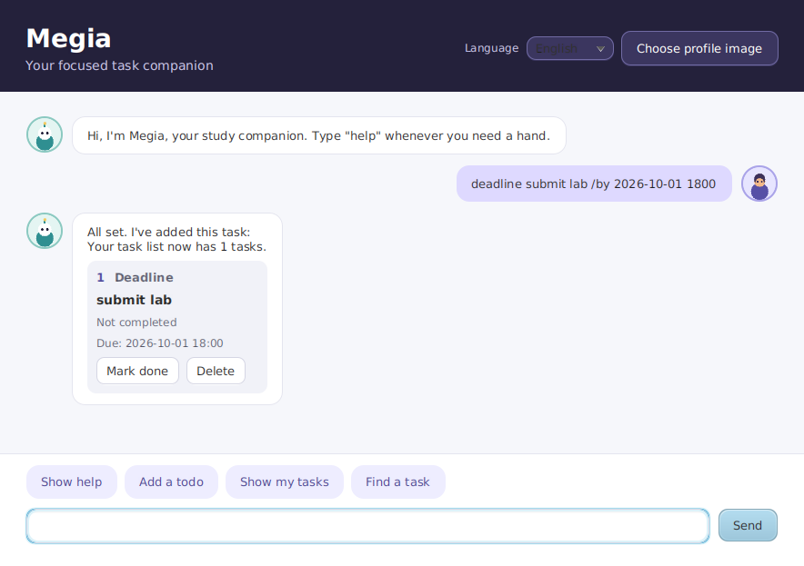

# Megia

Megia is a focused Java 25 task companion for todos, deadlines, and events.
Use the desktop GUI for a friendly chat-style workspace, or use the console
when you prefer a terminal.



## Get Megia running

Megia is available from the public [Megia source repository](https://github.com/ewonglh/ip).
Build the current self-contained GUI JAR from a fresh checkout:

```bash
git clone https://github.com/ewonglh/ip.git
cd ip
./gradlew shadowJar
java -jar build/libs/megia.jar
```

On Windows, use `gradlew.bat shadowJar` for the build step. The packaged
`megia.jar` launches the GUI and includes the JavaFX classes and native
libraries for Windows x86-64, macOS x86-64 and ARM64, and Linux x86-64 and
ARM64. Install JDK 25 before building or running it. The first build downloads
Gradle and JavaFX dependencies from Maven Central; no separate JavaFX install
is needed.

The packaged JAR is the easiest way to use Megia. When launched from a
terminal, it writes task data to the current directory. The public repository
is also a useful source download: build a fresh JAR from `master` so the
binary and this guide stay aligned.

### Run from the source checkout

To launch the GUI without building the packaged JAR:

```bash
./gradlew runGui
```

To use the console interface instead:

```bash
./gradlew run
```

The GUI and console share the same command language and task storage rules.
In the GUI, type a command in the composer and press Enter or select Send.
Starter buttons fill in common commands without executing them.

## Commands

Task numbers are one-based. The number shown by `list` is the number to use
with `mark`, `unmark`, and `delete`.

| Command | Example | Result |
| --- | --- | --- |
| `help` | `help` | Shows all supported commands and date/time formats in the active language. |
| `todo <description>` | `todo read the Java guide` | Adds an incomplete todo. |
| `deadline <description> /by <date and time>` | `deadline submit report /by 2026-12-02 1800` | Adds an incomplete deadline. |
| `event <description> /on <date> /from <time> /to <time>` | `event project meeting /on 2/12/2026 /from 1400 /to 1600` | Adds an event on one date. |
| `event <description> /from <date and time> /to <date and time>` | `event conference /from 2026-12-02 1400 /to 2026-12-03 1600` | Adds an event with complete endpoints, which may span dates. |
| `list` | `list` | Displays every stored task with its current task number. |
| `list <date>` | `list 2026-12-02` | Displays deadlines on that date and events spanning it. Todos are excluded. |
| `find <query>` | `find report` | Displays tasks whose descriptions contain the literal query. |
| `mark <task number>` | `mark 1` | Marks the selected task complete. |
| `unmark <task number>` | `unmark 1` | Marks the selected task incomplete. |
| `delete <task number>` | `delete 1` | Removes the selected task. The GUI asks for confirmation first. |
| `bye` | `bye` | Saves tasks and exits. The GUI closes after a successful save. |

Successful additions, marks, unmarks, and deletions are saved immediately.
The console prints a confirmation, while the GUI adds a confirmation and task
card to the transcript.

## Dates, times, and searches

- Dates use strict `YYYY-MM-DD` or day-first `D/M/YYYY`, such as
  `2026-12-02` or `2/12/2026`.
- Times use strict 24-hour `HHmm`, such as `0900`, `1400`, or `1800`.
- Combine a date and time with one space. Impossible dates and times are
  rejected.
- An event's end must be strictly later than its start.
- `list <date>` includes an event when it overlaps that calendar date. The
  event keeps its original task number, and todos do not appear in filtered
  results.
- `find` performs a literal, case-sensitive substring search. Spaces and
  punctuation are allowed, and matching tasks keep their original numbers.

## Language and profile image

The GUI Language selector switches between English and Chinese immediately.
The choice is saved in Java Preferences for future runs. The console uses the
same saved language but has no selector.

For the initial setting, change the following property before running from a
checkout or before packaging:

```properties
language=en
```

Use `language=cn` for Chinese. A saved GUI preference takes precedence on
later launches. Invalid or unavailable settings fall back to English.

To change the GUI avatar, select **Choose profile image** and choose a readable
PNG, JPG/JPEG, GIF, or BMP file. Megia stores the normalized path in Java
Preferences; it does not copy the image into task storage. If the file is
moved or unreadable, Megia uses the default avatar until another image is
selected.

## Storage and recovery

By default, tasks are stored in `./task_storage.csv`, relative to the directory
from which Megia is launched. The path is configured by `storage.task.path` in
`src/main/resources/application.properties`. The file is created when Megia
first saves tasks. Language and profile-image preferences are kept separately
in Java Preferences.

Task descriptions may contain commas and double quotation marks. For example:

```text
todo read "Java", second edition
```

The description is preserved when the CSV file is saved and loaded again. A
description must stay on one line; line breaks are rejected.

If an existing task file is unreadable or contains malformed data, Megia
reports the affected path and, when available, the malformed line instead of
overwriting it. In the GUI, commands and saving are disabled until the file is
repaired or removed externally and Megia is restarted. In the console, the
error is printed and the application stops; repair the file and restart it.

If the GUI cannot save during `bye` or window closing, it keeps the window and
task controls active and shows an error. Check that the storage folder is
writable, then retry. The console reports a save error before it exits; fix the
folder and start Megia again to retry.

## Public source

The [Megia repository](https://github.com/ewonglh/ip) is public and can be
cloned without signing in. It contains the source, Gradle build, tests, and
the configuration used to produce `build/libs/megia.jar`.
